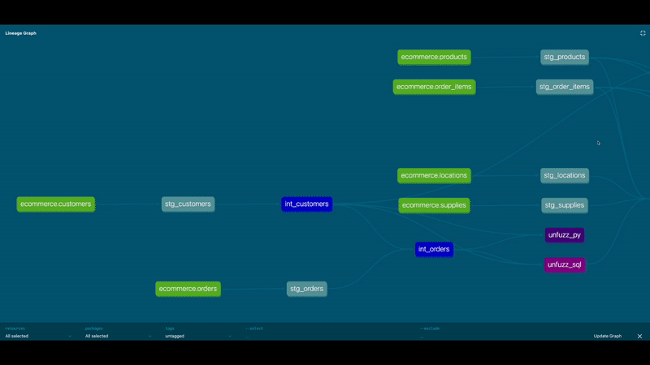
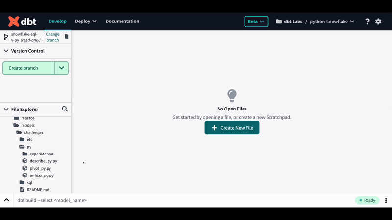

# dbt Python models on Databricks demo for Coalesce 2022

This repository contains a demo of dbt Python models on Databricks for the Coalesce 2022 conference. It will not be actively maintained. See the repository it was forked from for a current version -- we will work to merge the Python models into the `main` branch there after Coalesce.

## Cool gifs

What a cool DAG! Python and SQL side-by-side in dbt!

Python models in dbt Cloud!

## Setup

You should be setup as part of the workshop. You are expected to develop solutions to the challenges in a Databricks notebook, then transfer the code over to the dbt Cloud IDE for deployment in the dbt DAG.

## Challenges

See [workshop.ipynb](workshop.ipynb), intended for use in Databricks notebooks, for more details on the challenges.

The dbt models in `models/challenges/` in the `main` branch on this repo are intended to fail. Get them working!

### Level 1: Describe the orders table

Use the [describe_py.py](models/challenges/basics/describe_py.py) file.

### Level 2: Pivot the orders table

Use the [pivot_py.py](models/challenges/basics/pivot_py.py) file.

### Level 3: Cluster with KMeans

Use the [cluster_py.py](models/challenges/ml/cluster_py.py) file.

### Level 4: Forecast with Prophet

Use the [forecast_score_py.py](models/challenges/ml/forecast_train_py.py) file to train and persist the Prophet models, then [forecast_score_py.py](models/challenges/ml/forecast_score_py.py) to load them back in and get the predictions.

## Contributing

We'd welcome contributions to this demo project. However, we will likely archive this repository sometime after Coalesce 2022. Consider contributing to the repository this one is forked from instead!
